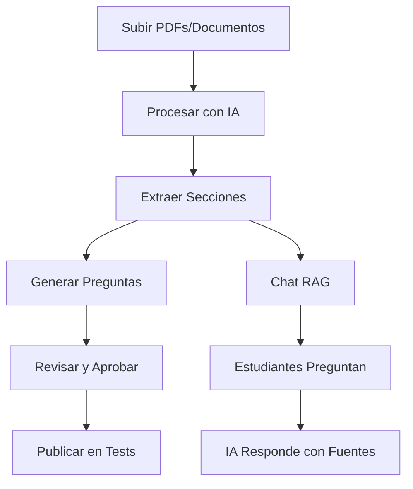

# 🤖 Sistema de IA Completo - OpositAPP

## ✨ Características Implementadas

### 1. **Extracción y Procesamiento de Contenido**
- ✅ Extracción de texto de PDF, TXT, DOC, DOCX
- ✅ División automática en secciones (artículos, capítulos, temas)
- ✅ Almacenamiento en base de datos con estructura jerarquizada
- ✅ Procesamiento masivo de todos los documentos del temario

### 2. **Generación de Preguntas con IA**
- ✅ Generación automática usando **Groq** (LLaMA 3.3 70B)
- ✅ Generación alternativa con **Ollama** (local, gratuito)
- ✅ Preguntas tipo test con 4 opciones
- ✅ Explicaciones detalladas
- ✅ 3 niveles de dificultad (fácil, medio, difícil)
- ✅ Sistema de revisión y aprobación antes de publicar

### 3. **Sistema RAG (Retrieval Augmented Generation)**
- ✅ Chat inteligente basado en documentos oficiales
- ✅ Búsqueda de contexto relevante
- ✅ Explicación de conceptos
- ✅ Generación de resúmenes
- ✅ Citación de fuentes automática

### 4. **Asistente de Estudio**
- ✅ Interfaz de chat amigable
- ✅ 3 modos: Chat, Explicar, Resumir
- ✅ Filtrado por tema específico
- ✅ Historial de conversación
- ✅ Respuestas con fuentes verificables

---

## 📁 Estructura de Archivos

```
opositapp/
├── app/
│   ├── admin/
│   │   ├── ai-documents/          # Gestión de documentos y preguntas IA
│   │   └── biblioteca-legal/       # Biblioteca legal compartida
│   ├── asistente-estudio/          # Chat RAG con IA
│   └── api/
│       ├── ai/
│       │   ├── process-document/   # Procesar y extraer contenido
│       │   ├── generate-questions/ # Generar preguntas con IA
│       │   ├── chat/               # RAG chat endpoint
│       │   └── batch-process/      # Procesamiento masivo
│       └── biblioteca-legal/       # API biblioteca legal
├── src/
│   └── lib/
│       ├── document-processor.ts   # Extracción de contenido
│       ├── ai-question-generator.ts # Generación con Groq/Ollama
│       └── rag-system.ts           # Sistema RAG completo
├── documentos-temario/
│   ├── general/                    # Temas 1-23 (general)
│   ├── especifico/                 # Temas 24-36 (específico)
│   └── biblioteca/                 # Documentos legales compartidos
└── data/
    ├── temario-config.json         # Configuración de archivos por tema
    └── biblioteca-legal.json       # Biblioteca de documentos legales
```

---

## 🚀 Guía de Uso

### **Paso 1: Subir Documentos**

#### Opción A: Biblioteca Legal (Recomendado)
1. Ir a `/admin/biblioteca-legal`
2. Subir leyes, reglamentos, etc. (PDF, TXT, DOC)
3. Los documentos se guardan en `documentos-temario/biblioteca/`
4. Pueden asociarse a múltiples temas sin duplicar

#### Opción B: Por Tema Individual
1. Ir a `/admin/temario-manager`
2. Subir archivo directamente en cada tema
3. Se guarda en `documentos-temario/general/` o `/especifico/`

### **Paso 2: Procesar Documentos con IA**

1. Ir a `/admin/ai-documents`
2. Clic en **"⚡ Procesar Todos los Documentos"**
3. El sistema:
   - Escanea `documentos-temario/` completo
   - Extrae contenido de cada archivo
   - Divide en secciones (artículos, capítulos)
   - Guarda en base de datos

**Resultado:** Documentos listos para generar preguntas y chat RAG

### **Paso 3: Generar Preguntas Automáticamente**

1. En `/admin/ai-documents`, tab **"Documentos"**
2. Seleccionar dificultad: Fácil / Medio / Difícil
3. Para cada documento, clic en **"🤖 Generar Preguntas"**
4. Elegir cantidad (ej: 10 preguntas)
5. Esperar generación (puede tardar 30-60 segundos)

**Modos de Generación:**
- **Groq** (online, rápido, requiere API key): LLaMA 3.3 70B
- **Ollama** (local, gratuito): Cambiar `useOllama: true` en el código

### **Paso 4: Revisar y Aprobar Preguntas**

1. Tab **"Preguntas IA"** en `/admin/ai-documents`
2. Ver todas las preguntas generadas
3. Para cada pregunta:
   - ✏️ **Editar**: Corregir texto, opciones, respuesta
   - ✅ **Aprobar**: Marcar como válida
   - ❌ **Rechazar**: Eliminar o marcar como no válida
4. Solo las preguntas **aprobadas** se usan en tests

### **Paso 5: Usar el Asistente de Estudio**

#### Para Estudiantes:
1. Ir a `/asistente-estudio` (enlace en Dashboard)
2. Seleccionar modo:
   - **💬 Chat Normal**: Preguntas y respuestas
   - **📖 Explicar**: Explicación didáctica de conceptos
   - **📝 Resumir**: Resúmenes de temas/leyes
3. (Opcional) Filtrar por tema específico
4. Escribir pregunta y enviar
5. La IA responde basándose en documentos oficiales
6. Ver fuentes citadas al final de cada respuesta

#### Ejemplos de Preguntas:
- "¿Qué dice la Constitución sobre los derechos fundamentales?"
- "Explícame el artículo 14 de la Ley 39/2015"
- "Resume el Tema 5: Organización Territorial"
- "¿Cuáles son las prestaciones de la Seguridad Social?"

---

## ⚙️ Configuración Requerida

### **Variables de Entorno** (`.env`)

```bash
# Base de datos
DATABASE_URL="postgresql://..."

# Groq API (para generación de preguntas online)
GROQ_API_KEY="gsk_..."

# NextAuth
NEXTAUTH_SECRET="..."
NEXTAUTH_URL="http://localhost:3000"
```

### **Obtener Groq API Key (GRATIS)**

1. Ir a https://console.groq.com
2. Crear cuenta
3. Generar API key
4. Copiar en `.env`
5. ✅ Incluye **30 requests/minuto GRATIS**

### **Ollama (Opcional - Local)**

Si prefieres NO usar API externa:

```bash
# 1. Instalar Ollama
brew install ollama

# 2. Descargar modelo
ollama pull llama3.2

# 3. Iniciar servidor
ollama serve

# 4. En el código, cambiar:
useOllama: true
```

---

## 📊 Base de Datos

### **Tablas Creadas** (en Prisma)

```prisma
model LegalDocument {
  id         String   @id @default(cuid())
  title      String
  type       String   // "ley", "temario_general", etc.
  topic      String?  // "Tema 1", "Tema 15", etc.
  reference  String?  // "Ley 39/2015"
  fileName   String?
  content    String   @db.Text
  sections   DocumentSection[]
  questions  GeneratedQuestion[]
}

model DocumentSection {
  id         String   @id
  documentId String
  title      String   // "Artículo 12", "Capítulo III"
  content    String   @db.Text
  order      Int
}

model GeneratedQuestion {
  id            String   @id
  documentId    String
  sectionId     String?
  text          String   @db.Text
  options       String   @db.Text  // JSON: ["A", "B", "C", "D"]
  correctAnswer String   // "A", "B", "C", "D"
  explanation   String?  @db.Text
  difficulty    String   // "easy", "medium", "hard"
  approved      Boolean  @default(false)
  reviewed      Boolean  @default(false)
}
```

### **Migración**

```bash
npx prisma db push
```

---

## 🎯 Flujo Completo de Uso



### **Ejemplo Práctico**

1. **Admin sube** `Ley_39_2015.pdf` a Biblioteca Legal
2. **Sistema procesa**: Extrae 85 páginas, 120 artículos
3. **Admin genera** 20 preguntas nivel medio
4. **Admin revisa**: Aprueba 18, edita 2
5. **Estudiante usa Chat**: "Explícame el silencio administrativo"
6. **IA responde**: Basándose en Art. 24 Ley 39/2015, cita fuente

---

## 🛠️ Troubleshooting

### **"Error al procesar PDF"**
- Verificar que `pdf-parse` está instalado: `npm install pdf-parse`
- Algunos PDFs escaneados no tienen texto extraíble

### **"Error en generación de preguntas"**
- Verificar `GROQ_API_KEY` en `.env`
- Límite: 30 req/min en plan gratuito
- Alternativamente, usar Ollama local

### **"No hay documentos en la biblioteca"**
- Subir documentos primero en `/admin/biblioteca-legal`
- Procesar con botón "Procesar Todos"

### **"La IA no responde correctamente"**
- Verificar que los documentos están procesados
- Usar preguntas más específicas
- Incluir el tema para filtrar mejor

---

## 📈 Rendimiento

### **Tiempos Estimados**

| Acción | Groq (Online) | Ollama (Local) |
|--------|---------------|----------------|
| Procesar 1 PDF (50 pág) | 5-10 seg | N/A |
| Generar 10 preguntas | 20-30 seg | 60-120 seg |
| Respuesta RAG chat | 3-5 seg | 10-20 seg |

### **Costos**

- ✅ **Groq**: GRATIS (30 req/min)
- ✅ **Ollama**: GRATIS (100% local)
- ✅ **Procesamiento**: GRATIS (sin APIs)

---

## 🔒 Seguridad

- ✅ Solo admins pueden procesar documentos
- ✅ Solo admins pueden generar preguntas
- ✅ Todos los usuarios autenticados pueden usar chat RAG
- ✅ Las preguntas se revisan antes de publicar
- ✅ No se envía información sensible a APIs externas

---

## 🚀 Próximas Mejoras

- [ ] Embeddings vectoriales con Pinecone/Weaviate
- [ ] Búsqueda semántica avanzada
- [ ] Generación de exámenes completos automáticos
- [ ] Explicaciones con imágenes/diagramas
- [ ] Multi-idioma (inglés, catalán, etc.)
- [ ] Feedback loop: Preguntas mal evaluadas → Regenerar
- [ ] Integración con voz (Speech-to-Text)

---

## 📞 Soporte

Para problemas o dudas:
1. Revisar esta documentación
2. Ver logs en consola del navegador
3. Ver logs del servidor Next.js
4. Contactar al equipo de desarrollo

---

**✅ Sistema Completo y Funcional**  
**Última actualización:** 28 de diciembre de 2025
